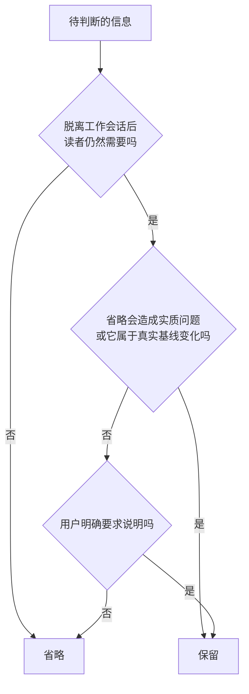

<p align="center">
  
</p>

<h1 align="center">No Negative Echo</h1>

<p align="center"><strong>Codex final-output hygiene · Codex 最终交付清理 Skill</strong></p>

<p align="center"><em>Ship the result, not the conversation.</em></p>

<p align="center">
  <strong>中文</strong> · <a href="./README_EN.md">English</a>
</p>

<p align="center">
  <a href="https://github.com/LB623/no-negative-echo/actions/workflows/test.yml"></a>
  <a href="https://github.com/LB623/no-negative-echo/stargazers"></a>
  
  
  
</p>

<p align="center">
  <a href="#about">关于</a> ·
  <a href="#install">安装</a> ·
  <a href="#usage">使用</a> ·
  <a href="#boundary">判断边界</a> ·
  <a href="#evaluation">评测</a> ·
  <a href="#feedback">反馈</a>
</p>

---

<a id="about"></a>

## 这是什么

方案已经改对，Agent 最后却把聊天里淘汰过的内容写进了标题、注释、commit 或 PR。`no-negative-echo` 专门清理这类会话残留。

```diff
- 标题：番茄炒蛋（没有东坡肉）
+ 标题：番茄炒蛋
```

它只用最终采用的结果来写正文和外层文案，并检查标题、文件名、代码注释、测试名、commit、PR、发布说明和交付说明。聊天里被否掉的草案只作为约束，不会带进项目历史。

### 为什么做这个 Skill

我已经手改过太多次 commit message。其中一类改得最多，我给它起了个固定名字：「移除此地无银三百两」。

典型场景是，让 Agent 做一盘番茄炒蛋，它先加了东坡肉。指出问题后，菜改对了，PR 标题却成了 `番茄炒蛋（无东坡肉）`，注释里还要解释为什么这道菜不需要东坡肉。

写文章也会碰到同样的问题。正文里的自证句删完，标题又冒出 `某某综述：不过度防御且无提示版`。成品已经和那些说法没关系，交付层却把纠正过程带了回来。

这个比喻来自 [@songkeys 的帖子](https://x.com/songkeys/status/2090416137720999992)，更完整的背景和讨论收在 [`BACKGROUND.md`](BACKGROUND.md)。

<a id="install"></a>

## 安装

目前只适配并验证了 Codex。

### 让 Codex 直接安装

把下面这段发给 Codex：

```text
请安装 no-negative-echo Skill。先克隆 https://github.com/LB623/no-negative-echo，再运行 python3 no-negative-echo/scripts/install_skill.py。安装后检查 SKILL.md、agents/openai.yaml 和图标文件是否完整，告诉我安装路径，并提醒我下一轮对话开始使用。
```

### 命令行安装

```bash
git clone --depth 1 https://github.com/LB623/no-negative-echo.git && python3 no-negative-echo/scripts/install_skill.py
```

脚本默认安装到 `${CODEX_HOME:-$HOME/.codex}/skills/no-negative-echo`。再次运行会替换旧版本，不会把旧目录里的评测文件和缓存带进运行包。替换失败时，脚本会恢复原目录。

安装完成后，重新加载或重启 Codex。

<a id="usage"></a>

## 使用

Codex 可以隐式加载它。长对话结束后，准备生成 commit、PR、发布标题或交付说明时，最好显式调用一次：

```text
$no-negative-echo
根据最终 diff 写 commit subject、PR 标题、PR 正文和交付说明。
```

文章场景可以这样用：

```text
$no-negative-echo
根据最终保留的正文重写标题和开篇。
```

### 它会检查哪些位置

| 位置 | 带着纠正过程 | 只写最终结果 |
|---|---|---|
| PR 标题 | `新增搜索（不用弹窗）` | `新增侧边栏搜索` |
| 代码注释 | `// 不再每秒检查` | `// 数据变化后刷新` |
| Commit | `搜索改版：删除弹窗方案，改成侧边栏` | `新增侧边栏搜索` |
| 文章标题 | `番茄炒蛋：不加东坡肉版` | `番茄炒蛋做法` |
| 交付说明 | `已去掉红色按钮和旧说明` | `提交按钮改为蓝色，测试通过` |

<a id="boundary"></a>

## 判断边界

这个 Skill 不做关键词清零。真实发生过的删除、迁移要求和安全信息，本来就应该写清楚。

| 内容 | 处理方式 |
|---|---|
| 只在聊天里讨论过、从未进入基线的方案 | 省略 |
| 未保存的助手草稿和中间尝试 | 省略 |
| 用户纠正过的标题框架、语气和自证句 | 省略 |
| 已发布的 v1 API 确实被删除 | 保留，并写清迁移方式 |
| 过敏原、安全规则、法律或兼容性要求 | 保留 |
| 用户明确要求的方案比较、审计和逐字引用 | 保留 |

每个输出位置都要单独判断：

- 没参与过这轮对话的读者，是否需要这条信息？
- 省略它，是否会带来安全风险、事实错误、误导、兼容性或合规问题？
- 它是否真实存在于权威基线中，而且当前产物需要说明这项变化？

第一项是前提。在此基础上，第二项或第三项至少满足一项，这条信息才保留。用户明确要求的方案比较、审计、逐字引用、发布记录或迁移说明也应保留。



这里的权威基线，指任务开始时的代码或已提交状态、已发布产品，以及用户确认过的产物。助手草稿、临时补丁和未采用方案都不算。真实删除公开 API 时，commit 和发布说明应该写清楚；某个方案只在聊天里出现过，Git 历史里就不该突然提到它。

## 能力边界

这是提示词层的缓解措施，不是确定性过滤器。它能降低会话残留进入成品的概率，但不能保证每次都拦住。

- Codex 是否隐式加载 Skill 由宿主决定，做重要交付时最好显式调用。
- Skill 无法擦除模型已经读到的上下文，也控制不了终端输出、工具日志和宿主生成的界面文案。
- 自带扫描器只能匹配明确写出的文本，换种说法的残留仍然要靠语义判断。
- 它处理最终交付里的会话残留，不负责阻止模型一开始做多余的实现。
- 凭据、个人信息和其他敏感数据仍应使用专门的密钥扫描或合规工具检查。

Claude Code、Cursor 等环境还没有做过独立的安装和行为测试，本仓库不会把它们写成已支持平台。

<a id="evaluation"></a>

## 开发和评测

运行本地测试：

```bash
python3 tests/test_scripts.py
```

安装目录 [`no-negative-echo/`](no-negative-echo/) 只放运行时文件。评测提示和答案放在 [`evals/`](evals/) 里，避免开发用例跟着 Skill 一起进入模型上下文。

公开用例只用于开发，跑通不等于问题消失。完整评测会分别运行无 Skill、简短对照提示、显式调用和隐式调用，每组都检查会话残留有没有泄漏，以及该保留的事实有没有被误删。格式和统计方法见 [`evaluation-protocol.md`](evals/evaluation-protocol.md)。

<details>
<summary>仓库结构</summary>

```text
.
├── .github/workflows/test.yml
├── BACKGROUND.md
├── README.md
├── README_EN.md
├── evals/
│   ├── evaluation-oracle.jsonl
│   ├── evaluation-prompts.jsonl
│   ├── evaluation-protocol.md
│   └── score_eval.py
├── no-negative-echo/
│   ├── SKILL.md
│   ├── agents/openai.yaml
│   ├── assets/
│   │   ├── icon-400.png
│   │   └── icon.png
│   └── scripts/check_surface.py
├── scripts/install_skill.py
└── tests/
    ├── evaluation-cases.md
    └── test_scripts.py
```

</details>

<a id="feedback"></a>

## 反馈

如果遇到新的「此地无银三百两」输出，提 Issue 时请带上原始请求、实际输出、期望输出和出现位置，再说明当时是显式调用还是隐式触发。提交前，请先替换真实凭据、个人信息和内部项目名。
