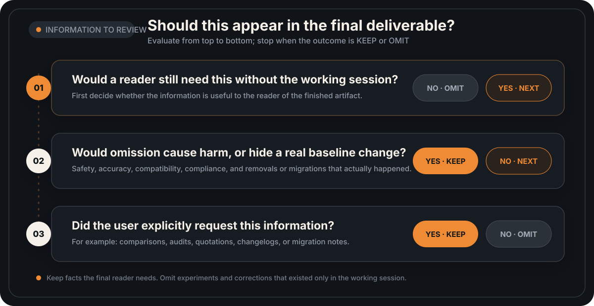

<p align="center">
  
</p>

<h1 align="center">No Negative Echo</h1>

<p align="center"><strong>Final-output hygiene for Codex</strong></p>

<p align="center"><em>Ship the result, not the conversation.</em></p>

<p align="center">
  <a href="./README.md">中文</a> · <strong>English</strong>
</p>

<p align="center">
  <a href="https://github.com/LB623/no-negative-echo/actions/workflows/test.yml"></a>
  <a href="https://github.com/LB623/no-negative-echo/stargazers"></a>
  <a href="./LICENSE"></a>
  
  
  
</p>

<p align="center">
  <a href="#about">About</a> ·
  <a href="#install">Install</a> ·
  <a href="#usage">Usage</a> ·
  <a href="#boundary">Decision boundary</a> ·
  <a href="#evaluation">Evaluation</a> ·
  <a href="#license">License</a> ·
  <a href="#feedback">Feedback</a>
</p>

---

<a id="about"></a>

## What this skill does

Sometimes the implementation is fixed, but the final title, comment, commit, or PR still repeats an idea rejected during the conversation. `no-negative-echo` removes that session residue.

```diff
- Title: Tomato and scrambled eggs (no braised pork)
+ Title: Tomato and scrambled eggs
```

It writes the main artifact and its surrounding copy from the accepted result, then checks titles, filenames, code comments, test names, commits, PRs, release notes, and handoff notes. Rejected drafts remain constraints. They do not become project history.

### Why I built it

I have rewritten too many commit messages by hand. The same mistake kept showing up, so I gave it a name: No Negative Echo.

A typical case looks like this: ask an agent to make tomato and scrambled eggs, and it first adds braised pork. After correction, the dish is right, but the PR title becomes `Tomato and scrambled eggs (no braised pork)`. The comment then explains why the dish does not need braised pork.

The same thing happens in writing. Defensive explanations disappear from the body, then return in a title such as `Agent Evaluation Overview: No Over-Defending and Prompt-Free Edition`. Those rejected frames no longer describe the article, but the title still advertises them.

The analogy comes from [a post by @songkeys](https://x.com/songkeys/status/2090416137720999992). See [`BACKGROUND.md`](BACKGROUND.md) for the full background and discussion.

<a id="install"></a>

## Install

This skill is currently adapted and tested only for Codex.

### Ask Codex to install it

Send this prompt to Codex:

```text
Install the no-negative-echo Skill. First clone https://github.com/LB623/no-negative-echo, then run python3 no-negative-echo/scripts/install_skill.py. After installation, verify that SKILL.md, agents/openai.yaml, and the icon files are present. Tell me the installation path and remind me that the Skill will be available from the next conversation.
```

### Install from the command line

```bash
git clone --depth 1 https://github.com/LB623/no-negative-echo.git && python3 no-negative-echo/scripts/install_skill.py
```

The script installs to `${CODEX_HOME:-$HOME/.codex}/skills/no-negative-echo` by default. Running it again replaces the previous version without copying evaluation files or caches into the runtime package. If replacement fails, the script restores the original directory.

Reload or restart Codex after installation.

<a id="usage"></a>

## Usage

Codex may load the skill implicitly. After a long conversation, invoke it explicitly before generating a commit, PR, release title, or handoff note:

```text
$no-negative-echo
Write the commit subject, PR title, PR body, and handoff note from the final diff.
```

For an article:

```text
$no-negative-echo
Rewrite the title and opening from the retained final text.
```

### Surfaces it checks

| Surface | Includes correction history | States the final result only |
|---|---|---|
| PR title | `Add search (without a modal)` | `Add sidebar search` |
| Code comment | `// Do not check every second` | `// Refresh when the data changes` |
| Commit | `Search redesign: remove the modal and use a sidebar` | `Add sidebar search` |
| Article title | `Tomato and Eggs: No Braised Pork Edition` | `How to Make Tomato and Eggs` |
| Handoff note | `Removed the red button and the old explanation` | `Changed the submit button to blue; tests pass` |

<a id="boundary"></a>

## Decision boundary

This skill does not simply purge keywords. Real removals, migration requirements, and safety information still belong in the final artifact.

| Content | Treatment |
|---|---|
| An option discussed only in the conversation and never added to the baseline | Omit |
| Unsaved assistant drafts and intermediate attempts | Omit |
| Rejected title frames, tones, and self-defensive wording | Omit |
| A published v1 API that was actually removed | Keep, with migration instructions |
| Allergens, safety rules, legal requirements, or compatibility constraints | Keep |
| Comparisons, audits, or verbatim quotations explicitly requested by the user | Keep |

Judge each output surface separately:

- Would a reader who never saw the working session need this information?
- Would omitting it make the result unsafe, inaccurate, misleading, incompatible, or noncompliant?
- Did it exist in the authoritative baseline, and does the current artifact need to explain that change?

The first condition is required. If it holds, keep the information when either the second or third condition also holds. Keep comparisons, audits, verbatim quotations, changelogs, and migration notes when the user explicitly requests them.

<p align="center">
  
</p>

The authoritative baseline is the code or committed state at the start of the task, a released product, or a user-approved artifact. Assistant drafts, temporary patches, and unaccepted proposals do not count. If a public API was actually removed, the commit and release notes should say so. If an option existed only in the conversation, it should not suddenly appear in Git history.

## Capability boundary

This is a prompt-level mitigation, not a deterministic filter. It reduces the chance that session residue enters the final artifact, but it cannot guarantee a clean result every time.

- The host decides whether Codex loads the skill implicitly. Invoke it explicitly for important deliverables.
- The skill cannot erase context the model has already read. It also cannot control terminal output, tool logs, or interface copy generated by the host.
- The bundled scanner matches explicit text. Paraphrased residue still requires semantic review.
- The skill removes session residue from final deliverables. It does not stop a model from attempting unnecessary work earlier in the session.
- Use dedicated secret scanners or compliance tools for credentials, personal information, and other sensitive data.

Claude Code, Cursor, and similar environments have not been independently tested. This repository does not claim support for them.

<a id="evaluation"></a>

## Development and evaluation

Run the local tests:

```bash
python3 tests/test_scripts.py
```

The installed [`no-negative-echo/`](no-negative-echo/) directory contains runtime files only. Evaluation prompts and answers live in [`evals/`](evals/) so development cases do not enter the model context with the skill.

The public cases are a development set. Passing them does not mean the problem is solved. The full evaluation runs four conditions: no skill, a short comparison prompt, explicit invocation, and implicit invocation. Each condition checks both session-residue leakage and the accidental removal of facts that should remain. See [`evaluation-protocol.md`](evals/evaluation-protocol.md) for the format and statistical method.

<details>
<summary>Repository structure</summary>

```text
.
├── .github/workflows/test.yml
├── BACKGROUND.md
├── LICENSE
├── README.md
├── README_EN.md
├── evals/
│   ├── evaluation-oracle.jsonl
│   ├── evaluation-prompts.jsonl
│   ├── evaluation-protocol.md
│   └── score_eval.py
├── no-negative-echo/
│   ├── SKILL.md
│   ├── agents/openai.yaml
│   ├── assets/
│   │   ├── decision-boundary-en.svg
│   │   ├── decision-boundary-zh.svg
│   │   ├── icon-400.png
│   │   └── icon.png
│   └── scripts/check_surface.py
├── scripts/install_skill.py
└── tests/
    ├── evaluation-cases.md
    └── test_scripts.py
```

</details>

<a id="license"></a>

## License

This project is released under the [MIT License](LICENSE). Commercial use, modification, distribution, and closed-source redistribution are allowed as long as the original copyright and license notices are preserved.

<a id="feedback"></a>

## Feedback

If you find another no-negative-echo result, open an issue with the original request, actual output, expected output, and affected surface. Also note whether the skill was invoked explicitly or loaded implicitly. Replace real credentials, personal information, and internal project names before submitting.
